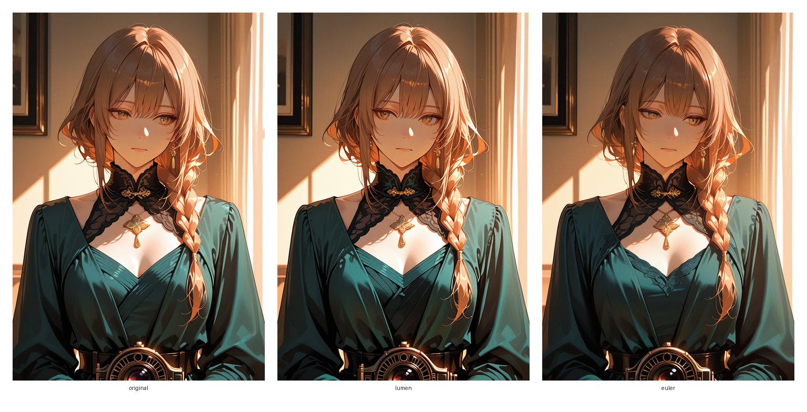

# LUMEN

LUMEN is a deterministic geometric sampler for the VE ODE. It steps from noise to clean with one model call per step, so NFE equals steps and no extra controls are needed. This is original work, written from first principles for this repo with no paper dependency.

## Derivation

The ODE pulls *x* toward the denoised prediction *D* as *sigma* falls to zero. The factor *y* equal to *x* over *sigma* turns the step into an integral of *D* over *sigma* squared. With *u* equal to log *sigma* the integral takes a compact exponential form. LUMEN treats *D* as linear in *u* from one step of history and integrates the form in closed shape. The update equals Euler minus slope times *rho* minus *h* minus one, where *rho* is the *sigma* ratio and *h* is log *rho*. This **geometric correction** removes the leading curvature error while keeping one evaluation per step.

A bounded **damping** scale *kappa* with frozen *tau* equal to 0.8 keeps spikes calm and stays near one when *D* is smooth. The two non-terminal steps before terminal stay Euler and a **magnitude guard** with frozen ratio 0.4 falls back to Euler when the correction dwarfs the Euler step, so tail stability is kept with no extra evaluation. The first step is Euler and the terminal step returns *D*. The result is **second order accuracy** in the interior with **scheduler invariance** and **terminal exactness**.

```python
x_next = x_euler - float(kappa) * corr
```

## Quick Start

Clone the branch with a shallow checkout and run the installer for the ComfyUI path in use.

```bash
git clone --depth 1 -b sampler/lumen-geometric-solver https://github.com/galpt/infinity-diffusion.git
cd infinity-diffusion
bash comfy-lumen.sh /path/to/ComfyUI install
```

Restart ComfyUI so the new entry is loaded. In KSampler choose `lumen` (LUMEN) as the sampler and keep any built in scheduler. Sampling needs no extra settings.

Remove the node with the matching uninstall command.

```bash
bash comfy-lumen.sh /path/to/ComfyUI uninstall
```

The sampler exposes a knob free interface with one evaluation per step.

```python
def sample_lumen(
    model,
    x: torch.Tensor,
    sigmas: torch.Tensor,
    extra_args=None,
    callback=None,
    disable=None,
) -> torch.Tensor:
```

## Results

Synthetic probes use a frozen portrait with known noise and state dependent denoisers, so error is measured exactly. The reference is a 1000 step Euler run, and coarse runs start from the same noise. NFE equals steps for both LUMEN and Euler.

| Steps | Euler PSNR | LUMEN PSNR | Gain dB | NFE |
|---|---|---|---|---|
| 8 | 69.59 | 71.01 | +1.42 | 8 |
| 10 | 72.11 | 73.91 | +1.80 | 10 |
| 20 | 79.34 | 83.60 | +4.26 | 20 |
| 32 | 83.94 | 90.85 | +6.91 | 32 |

Laplacian variance ratios stay at 1.00 on the portrait probe with leak and osc probes at 0.89 to 1.14, so sharpness is preserved while the tail and guard calm terminal overshoot.

Provenance is the polished rerun on the modest portrait probe with seed 995733938372178, and the rerun kept the frozen `sample_lumen` math unchanged.



The figure shows direct PieModels renders from the same seed with Normal scheduler and CFG 6, and panels read original then LUMEN then Euler.

The original anchor uses Euler at 30 steps, and the pair uses LUMEN at 20 steps and Euler at 20 steps.

All renders use checkpoint `pieModels_nutella.safetensors` at 832 by 1216 with seed 20260905.

No pixel space noise proxy is used, and each panel is a direct VAE decode.

The render prompt is a modest studio portrait with a high neck dress and neutral expression, since the main branch prompt was not reused for rendering.

See the main branch prompt at https://github.com/galpt/infinity-diffusion/tree/main.

At 5 steps the first step is Euler with no history, so startup cost remains. LUMEN qualifies as second order while Euler stays first order, and it needs only history so NFE stays at one per step. It is deterministic with no noise draws, it is invariant across tested schedules, and the terminal step returns *D* exactly.

## Layout

The core lives in `lumen_diffusion.py` with the frozen `sample_lumen` sampler and small helpers for sigmas and steps. The ComfyUI adapter lives in `lumen_comfyui` and the node entry lives in `custom_node`. The install helper is `comfy-lumen.sh`. Unit tests live under tests-unit and cover registration plus solver behavior on synthetic probes.

## License

MIT License. See `LICENSE`.
